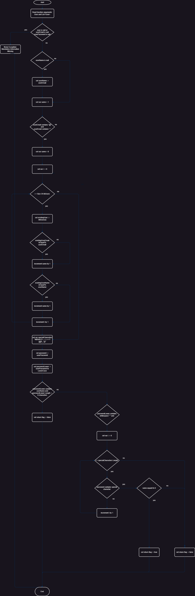

# Втора лабораториска вежба по Софтверско инженерство

## Марија Тимова, бр. на индекс 213028

## Control Flow Дијаграм
Еве како изгледа CF дијаграмот за методот function:


## Цикломатска сложеност
Цикломатската сложеност на одредена програма се пресметува со формулата:
```
M = E − N + 2P
```
каде M е цикломатска сложеност, E е бројот на гранки, N е бројот на јазли, а P е бројот на поврзани компоненти.

Во наведениот код, прво ќе ги преброиме бинарните точки на гранки (if, while, for наредби итн) и ќе додадеме 1.

* Првата if наредба проверува дали корисникот или лозинката на корисникот или е-маилот на корисникот се null: +1
* Втората if наредба проверува дали корисничкото име е null: +1
* Третата if наредба проверува дали е-маилот на корисникот содржи "@" и ".": +1
* for циклусот ги итерира сите корисници од листата: +1
* Во рамките на циклусот, две if наредби проверуваат дали е-маилот и корисничкото име на постоечкиот корисник се исти со влезниот корисник: +2
* Следната if наредба проверува дали passwordLower содржи корисничко име во мали букви или дали должината на лозинката е помала од 8: +1
* Во рамките на else блокот на горенаведената наредба, има уште една if наредба која проверува дали passwordLower не содржи " ": +1
* Во рамките на оваа if наредба, има for циклус кој проверува дали лозинката содржи некој специјален карактер: +2
* Додаваме 1 на вкупната сума (за точката на влез на методата) и цикломатската сложеност за дадениот код е 1 + 10 = 11.

Според добиениот резултат, може да заклучиме дека се работи за комплексна функција.

## Тест случаи според критериумот Every Branch
За да се постигне целосна покриеност на гранките за дадената функција, треба да напишеме тестови кои покриваат сите патеки низ кодот. Еве ги тест сценаријата за секоја гранка:

* Тест кога user е null - Ова треба да фрли RuntimeException.
* Тест кога user не е null но user.getPassword() е null - Ова треба да фрли RuntimeException. 
* Тест кога user и user.getPassword() не се null но user.getEmail() е null - Ова треба да фрли RuntimeException. 
* Тест кога user.getUsername() е null - Во овој случај, функцијата треба да го постави корисничкото име на е-маилот.
* Тест кога user.getEmail() не содржи "@" или "." - Во овој случај, треба да продолжи со извршување без да влезе во циклусот.
* Тест кога user.getEmail() содржи "@" и ".", но ниеден постоечки корисник нема ист е-маил или корисничко име - Ова треба да го постави same на 0 и да не го зголемува во циклусот.
* Тест кога постои постоечки корисник со истиот е-маил - Ова треба да го зголеми same во циклусот.
* Тест кога постои постоечки корисник со исто корисничко име - Ова треба да го зголеми same во циклусот.
* Тест кога passwordLower содржи username.toLowerCase() или password.length() е помала од 8 - Ова треба да врати false.
* Тест кога passwordLower не содржи username.toLowerCase() и password.length() е 8 или повеќе, но passwordLower содржи празно место - Ова треба да го прескокне циклусот и да врати false. 
* Тест кога passwordLower не содржи username.toLowerCase(), password.length() е 8 или повеќе, и passwordLower не содржи празно место, но password не содржи специјален знак - Ова треба да врати false.
* Тест кога passwordLower не содржи username.toLowerCase(), password.length() е 8 или повеќе, и passwordLower не содржи празно место, и password содржи специјален знак, но same не е 0 - Ова треба да врати false.
* Тест кога passwordLower не содржи username.toLowerCase(), password.length() е 8 или повеќе, и passwordLower не содржи празно место, и password содржи специјален знак, и same е 0 - Ова треба да врати true.

## Тест случаи според критериумот Multiple Condition
Во дадената функција, првиот "if" услов ги проверува три услови заедно со користење на логичкиот оператор ИЛИ (||). Проверува дали user е null, user.getPassword() е null или user.getEmail() е null.

Multiple Condition Test Case е дизајниран да ги покрие сите комбинации на овие услови. Со други зборови, треба да се тестира кога:

* user е null.
* user не е null, но user.getPassword() е null.
* user не е null, но user.getEmail() е null.
* user.getPassword() и user.getEmail() се null.
* Ниту user, ниту user.getPassword(), ниту user.getEmail() не се null (валиден корисник).
Овие случаи обезбедуваат дека секоја комбинација е тестирана и дека функцијата се однесува како што се очекува во сите овие случаи. Ова е основниот принцип на тест случај со повеќе услови - да се покријат сите можни комбинации на условите.

## Објаснување на напишаните unit tests

Пакетот mk.ukim.finki.si ги содржи сите напишани тестови. Класата SILab2Test содржи две тест методи: testEveryBranchCriterium() и testMultipleConditionCriterium().

Во testEveryBranchCriterium(), се напишани сите тест сценарија опишани според критериумот Every Branch.

Во testMultipleConditionsCriterium(), се напишани сите тест сценарија опишани според критериумот Multiple Condition.

